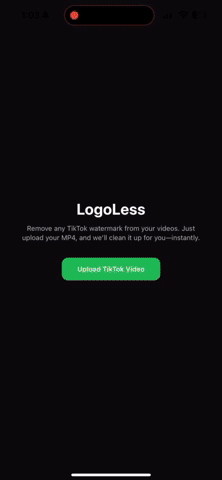
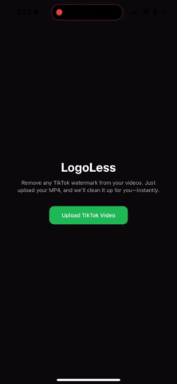

# 🔥 LogoLess

**Remove TikTok watermarks with ease.**  
LogoLess is a full-stack mobile app that allows users to upload TikTok videos and automatically blur out the watermark using computer vision. The app detects the watermark region with OpenCV and applies a Gaussian blur, giving you a clean, share-ready video.

---

## ✨ Features

- 📦 Upload `.mp4` TikTok videos directly from your phone
- 🎯 Automatically detects watermark location using PaddleOCR
- 🔄 Tracks and moves the blur region intelligently during playback
- 📱 Plays the processed video immediately in-app
- 💾 Allows saving the clean video to your camera roll

---

### 🎬 Demo

<p float="left">
  
  
  
</p>

## 🧠 Tech Stack

### ⚙️ Backend (Python + FastAPI)

- **FastAPI** for the API server
- **PaddleOCR** for robust username detection across low-res, varying aspect ratios, and challenging backgrounds
- **OpenCV** to detect and blur watermarks with template detection

### 📱 Frontend (React Native + Expo)

- **expo-video** to play processed videos
- **expo-document-picker** to upload `.mp4` videos
- **expo-file-system** to handle blob > file conversions
- **expo-media-library** to save videos to the device

---

## 🚀 Setup Instructions

### Clone the repository to your device:

```bash
git clone https://github.com/MitchBrenner/logoless-app.git
cd logoless
```

### 🐍 Backend (FastAPI + OpenCV)

#### 1. Set up a Python environment:

```bash
python -m venv venv
source venv/bin/activate  # or venv\Scripts\activate on Windows
```

#### 2. Install dependencies

```bash
pip install fastapi uvicorn paddlepaddle paddleocr opencv-python python-multipart
```

#### 3. Run the server:

```bash
uvicorn app.main:app --host 0.0.0.0 --port 8000
```

- Make sure to update app.main to your actual Python file path if needed.
- Ensure the server runs on the same Wi-Fi network as your mobile device.

### 📱 Frontend (Expo App)

#### 1. Install dependencies:

```bash
npm install
npx expo install expo-document-picker expo-video expo-file-system expo-media-library
```

#### 🔁 2. Configure API URL for Mobile Devices

To ensure your Expo app can talk to the FastAPI server from your phone, you **must not use `localhost`**. Your phone cannot access `localhost` on your computer — it needs your **computer’s local IP address**.

##### ✅ Option 1: Use an environment variable (recommended)

Create a `.env` file in the root of your project:

```env
EXPO_PUBLIC_IP_ADDRESS=http://192.168.X.X:8000
```

##### Option 2: Replace route in `index.tsx`

#### 3. Run the app:

```bash
npx expo start
```

### 🧠 Tech Stack

| Tech                    | Why It Was Chosen                                                        |
| ----------------------- | ------------------------------------------------------------------------ |
| **FastAPI**             | Fast, async Python API framework with easy routing                       |
| **PaddleOCR**           | Deep-learning OCR for robust text detection in low-res, cluttered scenes |
| **OpenCV**              | Powerful, mature library for image & video processing                    |
| **Expo (React Native)** | Rapid mobile development with access to native APIs                      |

### 📁 Why I Used File Picker Instead of Camera Roll

To ensure consistent `.mp4` support and reliable access to video files, I chose to use `expo-document-picker`. This opens the device's **file directory** instead of the photo gallery, allowing users to explicitly select `.mp4` files.
The result is a smoother, more predictable video upload experience for the user.

### 📸 How to Use the App

1. Start the FastAPI server (uvicorn app.main:app --host 0.0.0.0 --port 8000)
2. Run the Expo app (npx expo start)
3. Scan the QR code using Expo Go, or open it in a simulator
4. Tap “Upload TikTok Video” to choose an .mp4 file
5. Wait for the processing (a loading spinner will appear)
6. Preview the result with native controls
7. Tap “Save Video” to save it to your camera roll or clear to start over

### 🧪 Development Notes

- Detection interval is configurable (default 0.25 s; can be per-frame for max responsiveness).
- macOS quirk: Current macOS PaddlePaddle builds require re-initializing the OCR model each pass, adding a slight delay. A one-time warm-up or upcoming allocator fix will remove this overhead.
- If no watermark is detected, the server responds with { "success": false } — and the app alerts the user

### Future Updates

- Allow users to save and store videos in app until ready to save to device
- Let users choose where to blur or modify the blur
- Blur multiple at once
- Update UI
